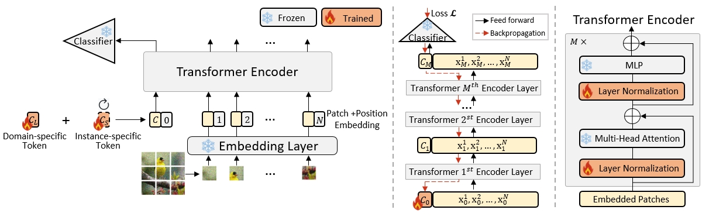

Implementation for "[Learning Visual Conditioning Tokens to Correct Domain Shift for Fully Test-time Adaptation](https://ieeexplore.ieee.org/abstract/document/10636806)".

<p align="center">

</p>


**Installation**:

- Python 3
- [PyTorch](https://pytorch.org/) >= 1.0
- [timm](https://github.com/rwightman/pytorch-image-models)

**Usage**:

```
python3 main.py --data_corruption /path/to/imagenet-c --exp_type [normal/bs1/mix_shifts/label_shifts] --method [no_adapt/tent/sar/vct] --model vitbase_timm --output /output/dir
```
